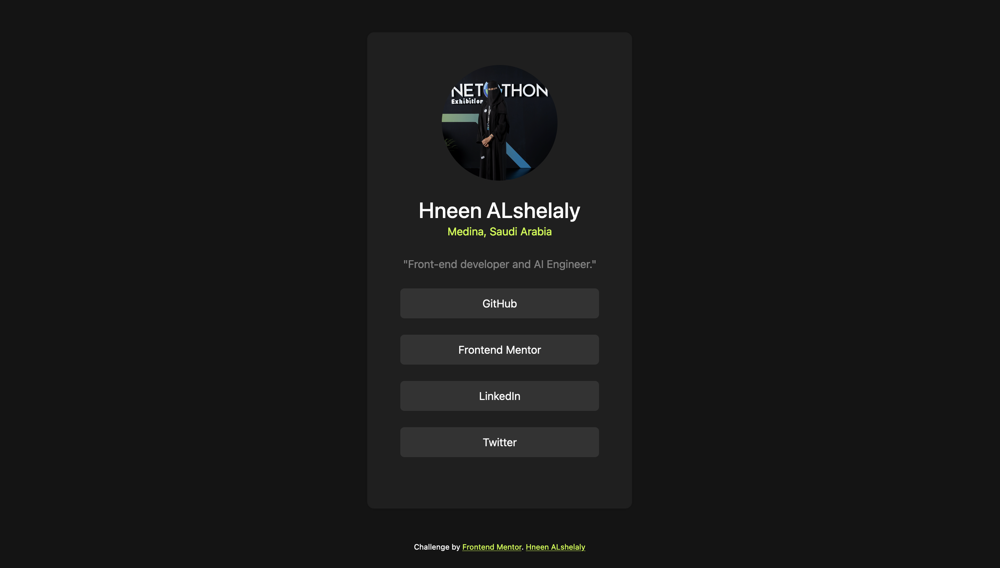

# Frontend Mentor - Social links profile solution

This is a solution to the [Social links profile challenge on Frontend Mentor](https://www.frontendmentor.io/challenges/social-links-profile-UG32l9m6dQ). Frontend Mentor challenges help you improve your coding skills by building realistic projects. 

## Table of contents

- [Overview](#overview)
  - [The challenge](#the-challenge)
  - [Screenshot](#screenshot)
  - [Links](#links)
- [My process](#my-process)
  - [Built with](#built-with)
  - [What I learned](#what-i-learned)
  - [Continued development](#continued-development)
  - [Useful resources](#useful-resources)
- [Author](#author)


## Overview

### The challenge

Users should be able to:


Your challenge is to build out this social links profile and get it looking as close to the design as possible.

- See hover and focus states for all interactive elements on the page

### Screenshot



hover and focus states:


### Links

- Solution URL: [Add solution URL here](https://your-solution-url.com)
- Live Site URL: [Add live site URL here](https://your-live-site-url.com)

## My process

### Built with

- Semantic HTML5 markup
- CSS custom properties
- [Bootstrap](https://getbootstrap.com/) - CSS framework


### What I learned

Bootstrap can help a lot wiht RDM websit a lot 


```css

@media screen and (max-width: 1200px) and (min-width: 990px){
    body{
        width: 100%;
    }
    .mineCard{
        font-size: small;
        width: 40%;
    }
}

@media screen and (max-width: 991px) and (min-width: 768px) {
    body{
        width: 100%;
    }
    .mineCard{
        width: 50%;
        font-size: smaller;
    }
    .mineCard p.devlp{
        font-size: smaller;
    }
    
}

@media screen and (max-width: 767px) and (min-width: 330px) {
    body{
        width: 100%;
    }
    .mineCard{
        width: 70%;
        font-size: smaller;
    }
    .mineCard p.devlp{
        font-size: smaller;
    }

    .SocialBtm{
        display: flex;
        justify-content: space-around;
    }
    
} 

```


If you want more help with writing markdown, we'd recommend checking out [The Markdown Guide](https://www.markdownguide.org/) to learn more.

**Note: Delete this note and the content within this section and replace with your own learnings.**

### Continued development

control the button size in RWD


### Useful resources

- [Responsive Web Design - Media Queries](https://www.w3schools.com/css/css_rwd_mediaqueries.asp) - This helped me for Customise Mobile view. I really liked this pattern and will use it going forward.

## Author

- Frontend Mentor - [@HneenAlshelaly](https://www.frontendmentor.io/profile/HneenAlshelaly)
- Twitter - [@nosta77lgic](https://www.twitter.com/nosta77lgic)
